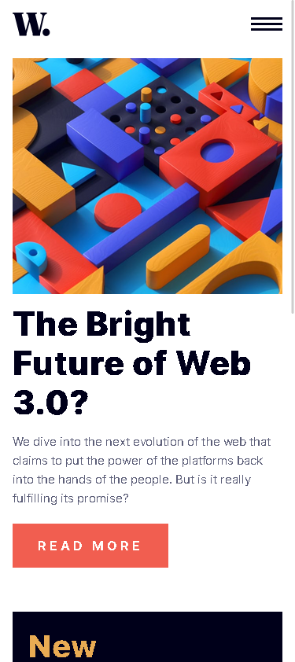

# Frontend Mentor - News homepage solution

This is a solution to the [News homepage challenge on Frontend Mentor](https://www.frontendmentor.io/challenges/news-homepage-H6SWTa1MFl). Frontend Mentor challenges help you improve your coding skills by building realistic projects.

## Table of contents

- [Overview](#overview)
  - [The challenge](#the-challenge)
  - [Screenshot](#screenshot)
  - [Links](#links)
- [My process](#my-process)
  - [Built with](#built-with)
  - [What I learned](#what-i-learned)
  - [Continued development](#continued-development)
- [Author](#author)

## Overview

### The challenge

Users should be able to:

- View the optimal layout for the interface depending on their device's screen size
- See hover and focus states for all interactive elements on the page

### Screenshot

](assets/images/desktop_ss.png)


### Links

- Solution URL: [Add solution URL here](https://your-solution-url.com)
- Live Site URL: [Add live site URL here](https://your-live-site-url.com)

## My process

I'm improving on my use of flexbox and grid property, but still lack on how to combine them. I work on my mobile first, It was easy but it gets hard when i need to change the flexbox and grid properties to match the desktop POV.

### Built with

- Semantic HTML5 markup
- CSS custom properties
- Flexbox
- CSS Grid
- Mobile-first workflow
- Sass/CSS
- JS

### What I learned

I learn how to make a simple hamburger menu, This code is somewhat still messy so I need to improve on how to clean my code.

To see how you can add code snippets, see below:

```html
<header class="header">
  <nav class="navbar">
    <!-- logo -->
    <a href class="nav-logo">
      
    </a>

    <!-- hamburger -->
    <div class="hamburger">
      <button class="hamburger-button">
        
      </button>
    </div>
    <!-- nav menu -->

    <ul class="nav-menu">
      <div class="close-container">
        <button class="close-button">
          
        </button>
      </div>
      <li class="nav-item">
        <a href class="nav-link">Home</a>
      </li>
      <li class="nav-item">
        <a href class="nav-link">New</a>
      </li>
      <li class="nav-item">
        <a href class="nav-link">Popular</a>
      </li>
      <li class="nav-item">
        <a href class="nav-link">Trending</a>
      </li>
      <li class="nav-item">
        <a href class="nav-link">Categories</a>
      </li>
    </ul>
  </nav>
</header>
```

```css
// header
.header {
  margin-bottom: 1.5em;
  .nav-logo {
    img {
      width: 3rem;
    }
  }
  .navbar {
    display: flex;
    justify-content: space-between;
    align-items: center;
    .hamburger {
      button {
        outline: none;
        border: none;
        background-color: white;
        .hamburger-icon {
          display: block;
        }
      }

      //   close icon
    }

    .nav-menu {
      position: absolute;
      background-color: $ntrl-off-white;
      top: 0;
      right: 0;

      list-style-type: none;

      display: none;
      flex-direction: column;

      animation: none;
      height: 100%;
      padding: 1.125em;
      gap: 1.5em;
      z-index: 1;
      overflow: hidden;

      button {
        float: right;
        outline: none;
        border: none;
        background-color: white;
        .close-icon {
          margin-top: 0em;
          margin-bottom: 4em;
        }
      }

      .nav-item {
        // nav-item / li
        color: $ntrl-very-dark-blue;
        font-size: 1rem;

        .nav-link {
          text-decoration: none;
          color: $ntrl-very-dark-blue;
        }

        &:hover .nav-link {
          color: $pmy-soft-red;
        }
      }
    }
  }
} //end of header
```

```js
function navClose() {
  const navmenu = document.querySelector(".nav-menu");
  const body = document.querySelector("body");

  navmenu.style.display = "none";
  body.style.backgroundColor = "white";
  body.style.overflow = "scroll";
}

function openNav() {
  const navmenu = document.querySelector(".nav-menu");
  const body = document.querySelector("body");

  navmenu.style.display = "flex"; // to see the menu
  navmenu.style.animation = "slideOpen .138s ease-in-out";
  navmenu.style.width = "65%"; // to set the width permanently
  body.style.backgroundColor = "rgba(0,0,0, .2)";
  body.style.overflow = "hidden"; //if the menu is open cant sctroll
}
```

### Continued development

I need to focus on combination of proper FlexBox and Grid property to make my website more clean and balanced. I still find it hard for me to combine the two and then change it when I'm facing media queries.

## Author

- Website - [Kyle Isaac Mendoza](https://www.your-site.com)
- Frontend Mentor - [@KyleIsaacMendoza](https://www.frontendmentor.io/profile/KyleIsaacMendoza)
