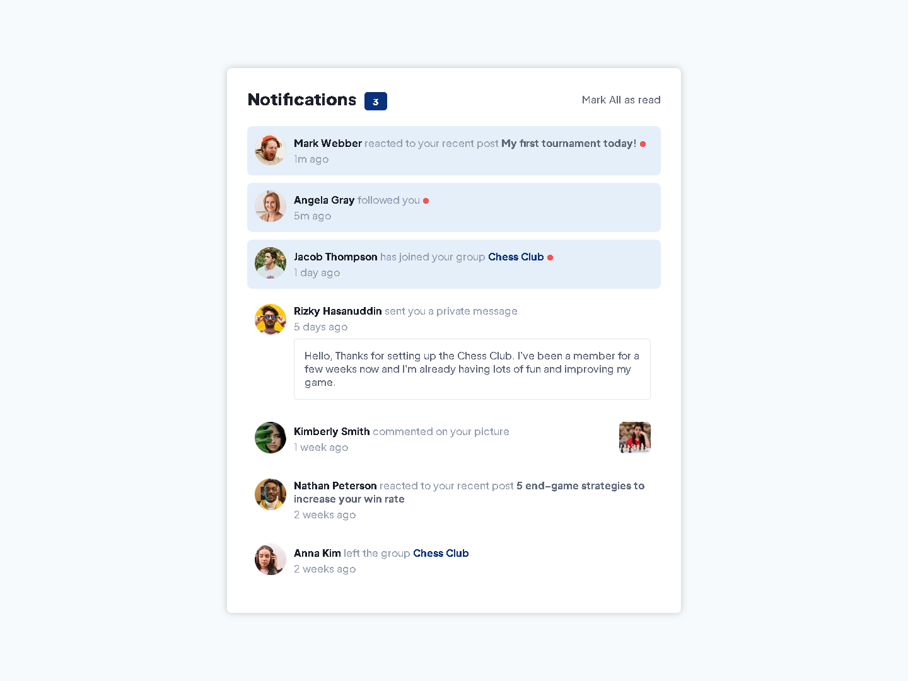
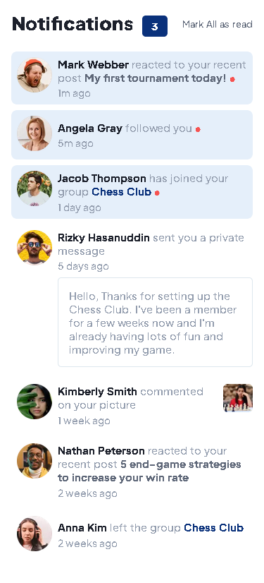

# Frontend Mentor - Notifications page solution

This is a solution to the [Notifications page challenge on Frontend Mentor](https://www.frontendmentor.io/challenges/notifications-page-DqK5QAmKbC). Frontend Mentor challenges help you improve your coding skills by building realistic projects.

## Table of contents

- [Overview](#overview)
  - [The challenge](#the-challenge)
  - [Screenshot](#screenshot)
  - [Links](#links)
- [My process](#my-process)
  - [Built with](#built-with)
  - [What I learned](#what-i-learned)
  - [Continued development](#continued-development)
- [Author](#author)

## Overview

### The challenge

Users should be able to:

- Distinguish between "unread" and "read" notifications
- Select "Mark all as read" to toggle the visual state of the unread notifications and set the number of unread messages to zero
- View the optimal layout for the interface depending on their device's screen size
- See hover and focus states for all interactive elements on the page

### Screenshot




### Links

- Solution URL: [Add solution URL here](https://www.frontendmentor.io/solutions/notification-page-responsive-1440-375px-_ACaVu_Uf0)

- Live Site URL: [Add live site URL here](https://kyleisaacmendoza.github.io/Front-End-Mentor-Projects/Notification-Page/notifications-page-main/)

## My process

### Built with

- Semantic HTML5 markup
- CSS custom properties
- Flexbox
- CSS Grid
- Mobile-first workflow
- Sass/Scss
- JavaScript ( toggle )

**Note: These are just examples. Delete this note and replace the list above with your own choices**

### What I learned

The major thing I learned about this project is how to use multiple flex-box, toggle() function in javascript, and how to add a content in CSS using ::after

```html
<div class="box">
  <div class="image">
    
  </div>
  <div class="box-content">
    <p class="activity">
      <a class="name" href>Kimberly Smith</a>
      commented on your picture
    </p>
    <span class="time">1 week ago</span>
  </div>
  <div class="picture">
    
  </div>
</div>
```

```css
.unread {
  &::after {
    content: "●";
    color: $pmy-red;
    font-size: 0.55rem;
  }
}
```

```js
function toggle() {
  const unreadBox = document.querySelectorAll(".unread-box");
  const unreadNotif = document.querySelectorAll(".unread");
  const notificationCount = document.querySelector(".count");
  for (var i = 0; i < unreadBox.length; i++) {
    unreadBox[i].classList.toggle("read-box");
    unreadNotif[i].classList.toggle("read");
  }
  notificationCount.textContent = "0";
}
```

### Continued development

Proper semantic and layout for HTML is the things I need to code cleanly next time. Better approach at designs, and lastly a functional approach but clean code in JavaScript

## Author

- Frontend Mentor - [@KyleIsaacMendoza](https://www.frontendmentor.io/profile/KyleIsaacMendoza)
